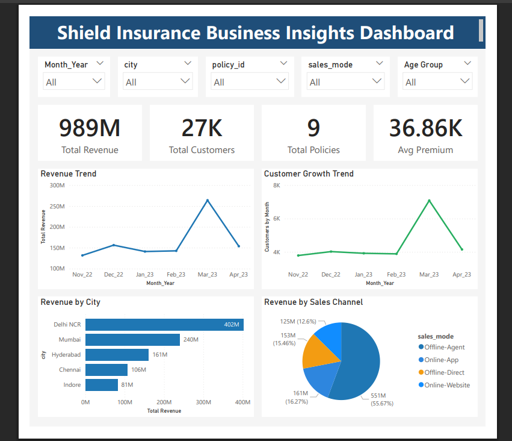
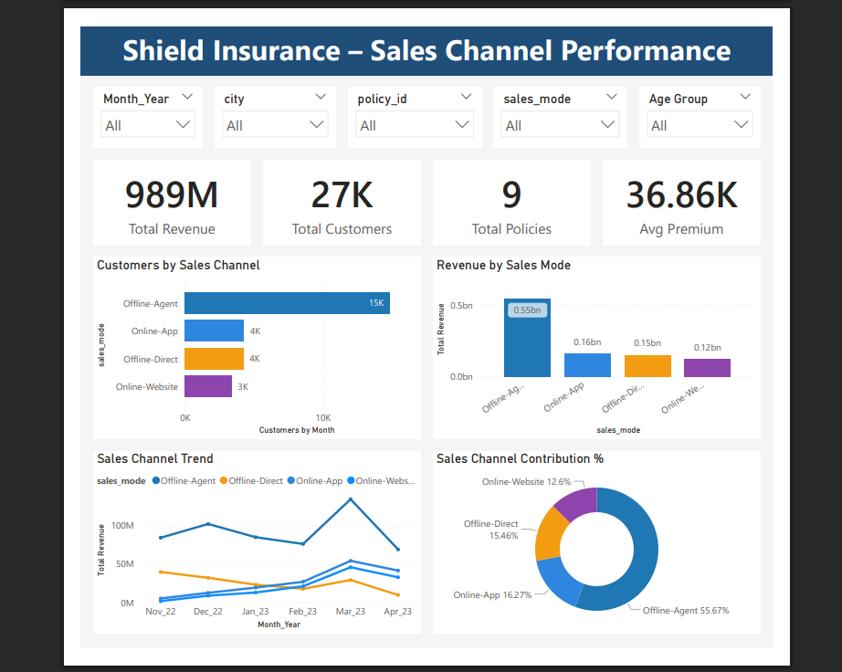
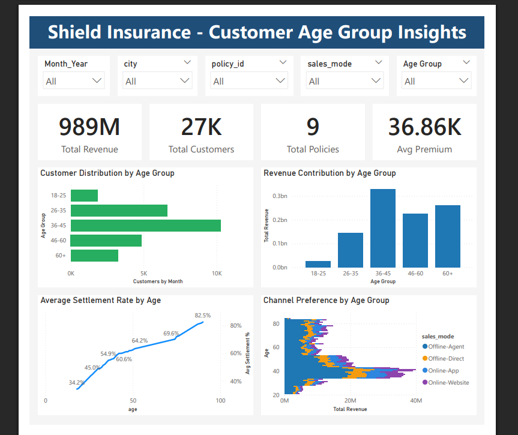

# Shield Insurance Business Insights Dashboard

## Project Overview
This project analyzes customer growth, revenue trends, and demographic insights for Shield Insurance using Power BI.

The dashboard provides insights into:
- Revenue performance
- Customer growth trends
- Sales channel performance
- Customer demographics by age group

## Dashboard Pages

### 1. Business Insights Dashboard
Displays:
- Total Revenue
- Total Customers
- Total Policies
- Average Premium
- Revenue Trend
- Customer Growth Trend
- Revenue by City
- Revenue by Sales Channel

### 2. Sales Channel Performance
Analyzes:
- Customers by Sales Channel
- Revenue by Sales Mode
- Sales Channel Trend
- Channel Contribution %

### 3. Customer Age Group Insights
Provides:
- Customer distribution by age group
- Revenue contribution by age
- Average settlement rate
- Channel preference by age group

## Key Insights
- Offline agents generate the highest revenue contribution.
- Customers aged 36–45 contribute the most revenue.
- Delhi NCR shows the highest revenue among cities.

## Project Files
- Dashboard PBIX
- Dashboard Mockup (PDF)
- Feature List (Excel)

 ## Dashboard Preview

### Business Insights Dashboard

### Sales Channel Performance

### Customer Age Group Insights

## Key Business Insights

• Offline Agents generate the highest revenue contribution.

• Customers aged 36–45 contribute the largest share of revenue.

• Delhi NCR shows the highest revenue among all cities.

• Online channels show steady growth in customer acquisition.

## Tools & Technologies

- Power BI
- Data Visualization
- Excel
- Business Intelligence
- Data Analysis

## Author
Raj Pashilkar
